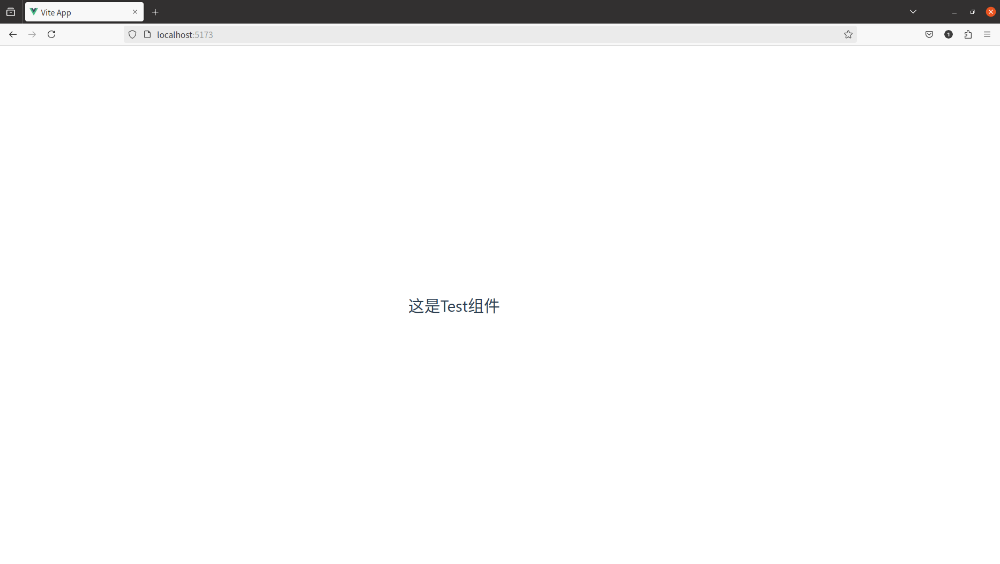

# 1.Vue3简介

一款用于构建用户界面的 JavaScript 框架。它基于标准 HTML、CSS 和 JavaScript 构建，并提供了一套声明式的、组件化的编程模型，帮助你高效地开发用户界面。

作者：尤雨溪

官网地址：https://cn.vuejs.org/guide/introduction.html


# 2.vite创建Vue3工程

vite是一种新型前端构建工具，能够显著提升前端开发体验。它主要由两部分组成：

- 一个开发服务器，它基于 [原生 ES 模块](https://developer.mozilla.org/en-US/docs/Web/JavaScript/Guide/Modules) 提供了 [丰富的内建功能](https://vitejs.cn/vite3-cn/guide/features.html)，如速度快到惊人的 [模块热更新（HMR）](https://vitejs.cn/vite3-cn/guide/features.html#hot-module-replacement)。
- 一套构建指令，它使用 [Rollup](https://rollupjs.org/) 打包你的代码，并且它是预配置的，可输出用于生产环境的高度优化过的静态资源。

作者：尤雨溪

官网地址：https://vitejs.cn/vite3-cn/guide/

vue3推荐使用vite构建。


webpack和vite的区别：

1.webpack 从入口文件=>所有路由=>所有模块=>打包=>服务已准备好

2.vite  服务已经准备好=>入口文件 =>只加载访问的路由=>加载对应模块


真正的按需编译，不在等待整个应用编译完成。

## 创建

```shell
➜  2_创建vue3工程 git:(master) ✗ npm create vue@latest
Need to install the following packages:
create-vue@3.10.4
Ok to proceed? (y) y


> npx
> create-vue


Vue.js - The Progressive JavaScript Framework

✔ 请输入项目名称： … vue-project
✔ 是否使用 TypeScript 语法？ … 否 / 是
✔ 是否启用 JSX 支持？ … 否 / 是
✔ 是否引入 Vue Router 进行单页面应用开发？ … 否 / 是
✔ 是否引入 Pinia 用于状态管理？ … 否 / 是
✔ 是否引入 Vitest 用于单元测试？ … 否 / 是
✔ 是否要引入一款端到端（End to End）测试工具？ › 不需要
✔ 是否引入 ESLint 用于代码质量检测？ … 否 / 是
✔ 是否引入 Vue DevTools 7 扩展用于调试? (试验阶段) … 否 / 是

正在初始化项目 /home/yantao/js/FrontendStudy/vue3/2_创建vue3工程/vue-project...

项目初始化完成，可执行以下命令：

  cd vue-project
  npm install
  npm run dev

npm notice
npm notice New patch version of npm available! 10.8.2 -> 10.8.3
npm notice Changelog: https://github.com/npm/cli/releases/tag/v10.8.3
npm notice To update run: npm install -g npm@10.8.3
npm notice
```


创建成功之后，执行命令

```shell
  cd vue-project
  npm install
  npm run dev
```


启动成功之后

```shell
  VITE v5.4.2  ready in 371 ms

  ➜  Local:   http://localhost:5173/
  ➜  Network: use --host to expose
  ➜  press h + enter to show help
```


## 文件介绍

```shell
➜  vue-project git:(master) ✗ tree           
.
├── env.d.ts			//在TypeScript项目中提供更好的类型检查支持
├── index.html 			//项目的入口文件，所有的JS和CSS将被注入到这个HTML文件中来构建应用
├── package.json		//包含项目的元数据（如名称、版本、描述等）以及依赖项和其他配置信息。
├── package-lock.json	//记录了项目的确切依赖树，包括所有依赖项的确切版本号，以便重现相同的开发环境
├── public				//存放静态资源的目录
│   └── favicon.ico
├── README.md
├── src					//源代码目录，存放所有源代码文件
│   ├── App.vue			//应用的主要组件，通常是根组件，其他组件会被嵌入到这里
│   ├── assets			//存放样式表、图像、字体等静态资源
│   │   ├── base.css
│   │   ├── logo.svg
│   │   └── main.css
│   ├── components		//组件目录，存放可重用的Vue组件
│   │   ├── HelloWorld.vue
│   │   ├── icons
│   │   │   ├── IconCommunity.vue
│   │   │   ├── IconDocumentation.vue
│   │   │   ├── IconEcosystem.vue
│   │   │   ├── IconSupport.vue
│   │   │   └── IconTooling.vue
│   │   ├── TheWelcome.vue
│   │   └── WelcomeItem.vue
│   └── main.ts			//从这里开始启动Vue实例
├── tsconfig.app.json	//TypeScript配置文件-应用程序
├── tsconfig.json		//TypeScript配置文件-整个项目
├── tsconfig.node.json	//TypeScript配置文件-node环境
└── vite.config.ts		//Vite构建工具的配置文件，定义了构建过程中的各种设置，如插件、别名等
```


## 运行流程

1.`Vite`项目中，`index.html`是项目的入口文件，在项目最顶层。

2.加载`index.html`后，Vite解析`index.html`里面的`<script type="module" src="/src/main.ts"></script>`指向的`/src/main.ts`。

3.main.ts详解

```ts
// 导入全局样式文件 main.css，这个文件通常包含一些应用于整个应用程序的样式规则。
import './assets/main.css';

// 从 Vue 库中导入 createApp 函数，这个函数用于创建一个新的 Vue 应用实例。
import { createApp } from 'vue';

// 从 './App.vue' 文件中导入根组件 App。
import App from './App.vue';

// 使用 createApp 函数创建一个新的 Vue 应用实例，并传入根组件 App。
// 然后调用 mount 方法将该实例挂载到 DOM 中的某个元素上，这里的 '#app' 是一个选择器，
// 它指向 index.html 中 id 为 app 的元素。
createApp(App).mount('#app');
```


4.以上，App组件的内容就被渲染到index.html，我们再看一下App组件都有什么。

App.vue

```vue
<!-- 使用 `<script setup>` 语法糖来定义组合式 API (Composition API) 的组件 -->
<script setup lang="ts">
// 导入 HelloWorld 和 TheWelcome 组件
import HelloWorld from './components/HelloWorld.vue';
import TheWelcome from './components/TheWelcome.vue';
</script>

<!-- 定义组件的模板结构 -->
<template>
  <header>
    
    <div class="wrapper">
      <!-- 渲染 HelloWorld 组件，并传递 "msg" 属性值为 "You did it!" -->
      <HelloWorld msg="You did it!" />
    </div>
  </header>

  <!-- 页面主体部分 -->
  <main>
    <!-- 渲染 TheWelcome 组件 -->
    <TheWelcome />
  </main>
</template>
```

现在页面的样子


## 创建自己的组件

我们模仿HelloWorld.vue组件创建自己的组件

首先创建 `./components/Test.vue`

```vue
<script setup lang="ts">

</script>

<template>
  <div>
    <h1>这是Test组件</h1>
  </div>
</template>
```


修改根组件如下，导入和使用Test组件


页面如下


为了看着清晰，接着删除其他组件，只保留Test组件

```vue
<script setup lang="ts">
// 删除其他组件，只保留Test组件
import Test from './components/Test.vue'
</script>

<template>
  <!-- 渲染Test组件 -->
  <Test />
</template>
```



这样一个我们自定义的组件就完成了。


# 3.Vue3核心语法

## 1.setup()

`setup()` 钩子是在组件中使用组合式 API 的入口。

我们可以使用响应式API来声明响应式的状态，在`setup`函数中返回的对象会暴露给模版和组件实例。

```vue
<script lang="ts">
export default {
  setup() {
    let name = "张三";
    let age = 18;
    let addr = "北京";
    return {name,age};
  },
};

</script>

<template>
  <div>
    <h1>这是Test组件</h1>
    <h1>{{ name }}</h1>
    <h1>{{ age }}</h1>
    <h1>{{ addr }}</h1>
  </div>
</template>
```


由于`return{}`中没有 `addr`，导致模版无法访问到`addr`。


为age添加点击事件，企图修改age

```vue
<template>  
    <div>  
      <h1>这是Test组件</h1>  
      <h1>{{ name }}</h1>  
      <h1>{{ age }}</h1> 
      <button @click="addOne">增加年龄</button>  
    </div>  
  </template>  
    
  <script lang="ts">  
  import { defineComponent } from 'vue';  
    
  export default defineComponent({  
    setup() {  
      let name = "张三";  
      let age = 18;
    
      const addOne = () => {  
        age++; 
        console.log(age); // 控制台会打印新的年龄值  
      };  
    
      return {  
        name,  
        age, 
        addOne,  
      };  
    },  
  });  
  </script>
```


`age`的值改变了，但是页面并没有变化，说明`age`不是响应式的。


## 2.`<script setup>`

在 `setup()` 函数中手动暴露大量的状态和方法非常繁琐。幸运的是，我们可以通过使用[单文件组件 (SFC)](https://cn.vuejs.org/guide/scaling-up/sfc.html) 来避免这种情况。我们可以使用 `<script setup>` 来大幅度地简化代码：


```vue
<template>
    <div>
        <h1>这是Test组件</h1>
        <h1>{{ name }}</h1>
        <h1>{{ age }}</h1>
        <button @click="addOne">增加年龄</button>
    </div>
</template>

<script setup lang="ts">
import { ref } from "vue";
let name = "张三";
let age = ref(20);
console.log(age); // ref 对象  
console.log(age.value); // ref.value 获取值  

const addOne = () => {
    age.value++;
    console.log(age); // ref 对象  
    console.log(age.value); // ref.value 获取值  
};
</script>
```


## 3.响应式基础

### 1.`ref()`

`ref()`创建一个带有`.value`属性的引用对象，它允许您存储任何类型的值。

#### `.value`存储基本类型

当你使用`ref()`存储基本类型（如数字、字符串、布尔值等）时，`.value`属性直接指向这个基本类型的值。

示例：

```vue
<script setup lang="ts">
import { ref } from "vue";

const age = ref(18);

age.value = 20;
</script>
```

在模版中vue会自动帮你解包，不需要使用`.value`。

```vue
<template>
    <div>
        <h1>Ref</h1>
        <br>
        <h1>{{ age }}</h1>
    </div>
</template>
```


#### `.value`存储引用类型

当`ref()`存储的是一个对象或者数组时，情况稍微复杂一些。尽管`.value`仍然直接指向这个对象或者数组，但是因为对象或者数组都是引用类型，所以在操作这些类型的数据时候需要注意一些细节。

**局部修改对象属性**

```vue
<script setup lang="ts">
//ref存储对象数据
const obj = ref({
    name: "张三",
    age: 18,
    sex: "男",
});
//局部修改对象的属性
obj.value.name = "李四";
obj.value.age = 35;
</script>
```

在模版中，vue同样会自动解包

```vue
<template>
		<h1>ref存储引用数据类型</h1>
        <h1>{{ obj.name }}</h1>
        <h1>{{ obj.age }}</h1>
        <h1>{{ obj.sex }}</h1>
<template>
```


**替换整个对象**

```vue
<script setup lang="ts">
//ref存储对象数据
const obj = ref({
    name: "张三",
    age: 18,
    sex: "男",
});
//修改对象的属性
obj.value.name = "李四";
obj.value.age = 35;

//替换整个对象
obj.value = {
    name: "iphone13",
    price: 9999,
    color: "red",
    brand: "apple",
};
</script>
```

如果你完全替换了原来的对象，并且新对象缺少某些字段，这种做法可能会带来一些响应性和视图更新方面的问题，特别是当缺失的字段在模板中被使用时。


#### 关键区别

- **基本类型**：当 `.value` 中存储的是基本类型时，你可以直接修改 `.value` 的值，整个值会被替换。
- **引用类型**：当 `.value` 中存储的是引用类型（对象或数组）时，修改 `.value` 的属性会导致对象内部的变化，而不是整个 `.value` 被替换。


#### 解包

在 Vue.js 中，“解包”是指从 `ref` 对象中提取实际的值。


### 2.`reactive()`

`reactive()`是用于创建响应式对象的函数。`reactive()`接受一个对象作为参数，并返回一个经过代理(Proxy)处理的响应式版本的该对象。这意味着可以在不改变原有对象结构的情况下直接操作这个对象，而不需要通过`.value`属性。

```vue
<script setup lang="ts">
//reactive存储引用数据类型
const car = reactive({
    name: "宝马",
    price: 5999,
    color: "black",
})
// 直接访问和修改对象的属性
car.price = 6999;
</script>
```


### ref和reactive区别

1. **数据类型**：

   - `ref()` 返回一个带有 `.value` 属性的对象，适用于基本类型和复杂类型。
   - `reactive()` 直接返回一个响应式的对象，适用于复杂类型（如对象和数组）。

2. **访问方式**：

   - `ref()` 需要通过 `.value` 访问内部值。
   - `reactive()` 可以直接访问对象的属性。

3. **使用场景**：

   - `ref()` 更适合创建单个响应式的变量，尤其是基本类型。
   - `reactive()` 更适合创建复杂的响应式数据结构，如对象和数组。

   ### 总结

   - **`reactive()`**：用于创建复杂的响应式数据结构，如对象和数组。
   - **直接访问**：可以像操作普通对象一样直接访问和修改属性。
   - **响应性**：更改对象的属性会自动触发视图更新。


### 3.computed()

计算属性，用于基于其他数据属性创建派生属性。计算属性会根据其依赖的数据自动更新，并且在数据发生变化事自动重新计算。这使得你可以轻松定义和使用复杂的派生数据。

#### 基本用法

使用`computed`函数定义计算属性

在 Vue 3 中，计算属性（Computed Properties）是一种非常有用的功能，用于基于其他数据属性创建派生属性。计算属性会根据其依赖的数据自动更新，并且在数据发生变化时自动重新计算。这使得你可以在组件中轻松地定义和使用复杂的派生数据。

#### 计算属性的基本用法

在 Vue 3 中，计算属性可以通过 `setup` 函数中的组合 API 来实现。Vue 提供了 `computed` 函数来帮助你定义计算属性。

示例代码

```javascript
<script setup lang="ts">
import { ref, computed } from 'vue'
//声明基础数据
const Income = ref(10)//收入
const Expense = ref(20)//支出
//计算属性
const Total = computed(() => {
    return Income.value - Expense.value
})

const decreaseIncome = () => {
    Income.value -= 1
}

const increaseIncome = () => {
    Income.value += 1
}

const decreaseExpense = () => {
    Expense.value -= 1
}
const increaseExpense = () => {
    Expense.value += 1
}

</script>

<template>
    <h1>计算属性</h1>
    <div>
        <button @click="decreaseIncome">-</button>
        <span>收入：{{ Income }}</span>
        <button @click="increaseIncome">+</button>
    </div>
    <div>
        <button @click="decreaseExpense">-</button>
        <span>支出：{{ Expense }}</span>
        <button @click="increaseExpense">+</button>
    </div>
    <div>盈亏：{{ Total }}</div>
</template>
```

#### 计算属性的特点

1. **依赖其他数据**：计算属性可以根据其他数据属性的值来计算结果。
2. **缓存机制**：计算属性只有在其依赖的数据发生改变时才会重新计算，这提高了性能。
3. **可读性和可维护性**：计算属性使代码更加清晰，易于理解。

#### 使用计算属性的模板

在模板中，你可以直接使用计算属性，如下所示：

```html
<template>
    <h1>计算属性</h1>
    <div>
        <button @click="decreaseIncome">-</button>
        <span>收入：{{ Income }}</span>
        <button @click="increaseIncome">+</button>
    </div>
    <div>
        <button @click="decreaseExpense">-</button>
        <span>支出：{{ Expense }}</span>
        <button @click="increaseExpense">+</button>
    </div>
    <div>盈亏：{{ Total }}</div>
</template>
```

#### 计算属性与方法的区别

1. **计算属性**：
   - 自动缓存：只有当依赖的数据发生变化时才重新计算。
   - 代码更简洁：更容易理解和维护。
   - 适用于简单的派生数据。

2. **方法**：
   - 每次调用都会执行：不会自动缓存结果。
   - 更适合处理复杂逻辑或需要频繁执行的操作。
   - 适用于复杂的派生数据或需要多次执行的操作。

#### 总结

- **计算属性**：用于定义基于其他数据属性的派生属性。
- **性能优化**：计算属性只有在依赖的数据发生变化时才会重新计算，提高了性能。
- **可读性和可维护性**：计算属性使代码更加清晰，易于理解和维护。

通过使用计算属性，你可以简化组件中的逻辑，并确保数据的一致性和响应性。这对于构建复杂的应用程序来说是非常有用的。


### 4.watch()

在 Vue.js 中，`watch` 是一种非常有用的功能，用于监听数据属性的变化，并在变化时执行特定的回调函数。这使得你可以在数据发生变化时执行一些副作用操作，例如发起网络请求、更新其他数据或执行某些计算。

#### `watch` 的基本用法

在 Vue 3 中，`watch` 可以通过组合 API 来使用，主要通过 `watch` 函数来实现。

第一个参数是侦听器的**源**。这个来源可以是以下几种：

- 一个函数(这个函数会返回一个值)
- 一个 ref
- 一个reactive创建的响应式对象
- 或是由以上类型的值组成的数组


第二个参数是在发生变化时要调用的回调函数。这个回调函数接受三个参数：新值、旧值，以及一个用于注册副作用清理的回调函数。该回调函数会在副作用下一次重新执行前调用，可以用来清除无效的副作用，例如等待中的异步请求。


第三个可选的参数是一个对象，支持以下这些选项：

- **`immediate`**：在侦听器创建时立即触发回调。第一次调用时旧值是 `undefined`。
- **`deep`**：如果源是对象，强制深度遍历，以便在深层级变更时触发回调。即监听其内部属性的变化。
- **`flush`**：调整回调函数的刷新时机。参考[回调的刷新时机](https://cn.vuejs.org/guide/essentials/watchers.html#callback-flush-timing)及 [`watchEffect()`](https://cn.vuejs.org/api/reactivity-core.html#watcheffect)。
- **`onTrack / onTrigger`**：调试侦听器的依赖。参考[调试侦听器](https://cn.vuejs.org/guide/extras/reactivity-in-depth.html#watcher-debugging)。
- **`once`**：回调函数只会运行一次。侦听器将在回调函数首次运行后自动停止。


#### 示例代码

```html
<template>
  <div>
    <label for="input">输入值：</label>
    <input type="text" id="input" v-model="inputValue" />
    <p>输入值的大写形式：{{ uppercaseValue }}</p>
  </div>
</template>

<script setup lang="ts">
import { ref, watch } from 'vue';

// 声明基础数据
const inputValue = ref('');

// 计算属性
const uppercaseValue = computed(() => inputValue.value.toUpperCase());

// 使用 watch 监听 inputValue 的变化
watch(inputValue, (newValue, oldValue) => {
  console.log(`Input value changed from "${oldValue}" to "${newValue}"`);
});

// 方法
const clearInput = () => {
  inputValue.value = '';
};
</script>

<style scoped>
/* 可以在这里添加一些样式 */
input {
  margin: 5px;
}
</style>
```

#### 详细解释

1. **声明基础数据**：
   - `inputValue` 是一个 `ref` 变量，用于存储输入框的值。

2. **计算属性**：
   - `uppercaseValue` 是一个计算属性，用于将 `inputValue` 转换为大写形式。

3. **使用 `watch` 监听数据变化**：
   - `watch(inputValue, (newValue, oldValue) => {...})` 用于监听 `inputValue` 的变化。
   - 当 `inputValue` 发生变化时，回调函数会被调用，传入新的值 `newValue` 和旧的值 `oldValue`。

4. **方法**：
   - `clearInput` 用于清空输入框的值。

#### `watch` 的选项

`watch` 函数还可以接受一个配置对象，用于指定一些选项，如立即执行和深度监听。

#### 示例代码

```html
<template>
  <div>
    <label for="input">输入值：</label>
    <input type="text" id="input" v-model="inputValue" />
    <p>输入值的大写形式：{{ uppercaseValue }}</p>
    <button @click="clearInput">清空输入</button>
  </div>
</template>

<script setup lang="ts">
import { ref, computed, watch } from 'vue';

// 声明基础数据
const inputValue = ref('');

// 计算属性
const uppercaseValue = computed(() => inputValue.value.toUpperCase());

// 使用 watch 监听 inputValue 的变化
watch(
  inputValue,
  (newValue, oldValue) => {
    console.log(`Input value changed from "${oldValue}" to "${newValue}"`);
  },
  {
    immediate: true, // 立即执行一次
    deep: true // 深度监听（对于对象和数组有效）
  }
);

// 方法
const clearInput = () => {
  inputValue.value = '';
};
</script>

<style scoped>
/* 可以在这里添加一些样式 */
input {
  margin: 5px;
}
</style>
```

#### 选项解释

1. **`immediate`**：
   - 如果设置为 `true`，则在 `watch` 开始时立即执行一次回调函数。

2. **`deep`**：
   - 如果设置为 `true`，则会对对象和数组进行深度监听，即监听其内部属性的变化。

#### 更复杂的示例

**监听一个对象的变化**

示例代码

```html
<template>
  <div>
    <label for="user">用户信息：</label>
    <input type="text" id="user-name" v-model="userInfo.name" />
    <input type="text" id="user-age" v-model="userInfo.age" />
    <p>用户信息：{{ userInfo }}</p>
  </div>
</template>

<script setup lang="ts">
import { ref, watch } from 'vue';

// 声明基础数据
const userInfo = reactive({
  name: '',
  age: ''
});

// 使用 watch 监听 userInfo 的变化
watch(userInfo, (newVal, oldVal) => {
  console.log(`User info changed from`, oldVal, 'to', newVal);
}, {
  deep: true
});

// 方法
const resetUserInfo = () => {
  userInfo.name = '';
  userInfo.age = '';
};
</script>

<style scoped>
/* 可以在这里添加一些样式 */
input {
  margin: 5px;
}
</style>
```

#### 说明

1. **声明基础数据**：
   - `userInfo` 是一个使用 `reactive` 创建的响应式对象，包含 `name` 和 `age` 属性。

2. **使用 `watch` 监听对象的变化**：
   - `watch(userInfo, (newVal, oldVal) => {...}, { deep: true })` 用于监听 `userInfo` 的变化。
   - 当 `userInfo` 内部的属性发生变化时，回调函数会被调用，传入新的值 `newVal` 和旧的值 `oldVal`。

3. **方法**：
   - `resetUserInfo` 用于重置 `userInfo` 的值。

#### 总结

`watch` 是 Vue 中非常有用的功能，用于监听数据属性的变化，并在变化时执行特定的回调函数。通过 `watch`，你可以：

- 在数据变化时执行某些操作。
- 使用 `immediate` 选项立即执行一次。
- 使用 `deep` 选项进行深度监听，`watch` 会递归地监听对象内部的所有属性

希望这些示例能帮助你更好地理解和使用 Vue 中的 `watch` 功能。如果有任何进一步的问题，请随时提问！


#### 问题

为什么连续点击两次“年龄+1”，控制台打印的年龄是 20 和 20，而不是 19 和 20？


在 Vue 3 中，使用 `reactive` 创建的对象是响应式的，这意味着对象内部的属性变化也会被跟踪。但是，当使用 `watch` 来监听整个对象的变化时，如果想要捕捉到对象内部属性的变化，需要使用 `deep` 选项。

然而，使用 `deep` 选项并不意味着每次内部属性变化时都会立即触发 `watch` 的回调。实际上，Vue 为了提高性能，会将同一事件循环内的多次变化合并为一次，因此你可能会观察到连续多次修改同一个对象的属性时，`watch` 的回调只被触发一次。


这是因为 Vue 的响应系统会将同一事件循环内的多次变化合并。具体来说：

1. **第一次点击**：
   - `ageAdd` 函数被调用，`person.age` 增加 1，从 18 变为 19。
   - 由于这是在同一个事件循环内发生的，Vue 会记录这次变化。

2. **第二次点击**：
   - `ageAdd` 函数再次被调用，`person.age` 再次增加 1，从 19 变为 20。
   - 同样，这是在同一事件循环内发生的，Vue 会记录这次变化。

3. **事件循环结束**：
   - Vue 在事件循环结束时，会将两次变化合并为一次，因此 `watch` 的回调函数只被触发一次。
   - 最终 `person` 的值变为 `{ name: '张三', age: 20 }`，因此 `watch` 的回调函数中打印的值为 20。

如何验证这一点

你可以尝试将 `watch` 的回调改为接收两个参数 `newValue` 和 `oldValue`，并通过打印这两个参数来观察变化：

```html
<template>
    <hr>
    <h1>监听引用类型</h1>
    <div>
        <p>姓名：{{ person.name }}</p>
        <p>年龄：{{ person.age }}</p>
        <button @click="ageAdd">年龄+1</button>
    </div>
</template>

<script setup lang="ts">
import { ref, watch, computed, reactive } from 'vue';

// 监听引用类型
const person = reactive({ name: '张三', age: 18 });

// 使用 watch 监听 person 的变化
watch(person, (newValue, oldValue) => {
    console.log('person变化了', newValue, oldValue);
}, { deep: true });

function ageAdd() {
    person.age++;
}
</script>
```

运行效果

当你连续快速点击按钮时，你会看到控制台输出：

```
person变化了 { name: '张三', age: 20 } { name: '张三', age: 18 }
```

这表明虽然连续点击了两次按钮，但 `watch` 的回调只被触发了一次，因为 Vue 将两次变化合并了。

总结

Vue 3 的响应系统设计为高效地处理变化，这意味着它会将同一事件循环内的多次变化合并。因此，当连续修改同一个对象的属性时，`watch` 的回调可能只会被触发一次，而不是按修改次数触发。这种行为有助于提高性能，特别是在频繁变化的场景下。

希望这些解释能够帮助你更好地理解 Vue 的响应系统以及 `watch` 的工作原理。如果有更多问题或需要进一步的帮助，请随时提问！


解决：

使用 **`watchEffect`**：确保每次属性变化时都能触发回调。

```vue
<template>
    <div>WatchEffect</div>
    <div>{{ person.age }}</div>
    <button @click="incrementAge">+</button>
    <button @click="decrementAge">-</button>
</template>

<script setup lang="ts">
import { reactive, watchEffect } from 'vue';

const person = reactive({ name: '张三', age: 18 });

// 使用 watchEffect 来监听 person.age 的变化
watchEffect(() => {
    console.log('count change', person.age);
});

// 定义增加年龄的方法
function incrementAge() {
    person.age++;
}

// 定义减少年龄的方法
function decrementAge() {
    person.age--;
}
</script>
```


**监听一个对象的属性变化**。（一个函数(这个函数会返回一个值)）

而且不回有连续点击的问题。

```ts
// 监听引用类型的某个属性
watch(() => person.age, (val) => {
    console.log('person变化了', val);
}, { deep: true });
```


### 5.`watchEffect()`

watch需要把要监听的数据作为第一个参数传入，但是watchEffect就不需要参入北欧监听的参数了，如果在watchEffect调用了哪个数据，就会触发。

#### `watchEffect` 的工作机制

`watchEffect` 是 Vue 3 提供的一种响应式依赖追踪机制。它会在首次执行时收集依赖项，并在这些依赖项发生变化时自动重新执行。下面是 `watchEffect` 的几个关键特性：

1. **依赖追踪**：
   - `watchEffect` 在首次执行时会追踪其内部访问的所有响应式数据。
   - 在你的例子中，`watchEffect` 会追踪 `person` 对象及其属性 `age`。

2. **依赖收集**：
   - 当 `watchEffect` 首次执行时，它会收集所有被访问的响应式数据作为依赖项。
   - 如果 `watchEffect` 内部访问了 `person.age`，那么 `person.age` 就会被收集为依赖项。

3. **依赖更新**：
   - 当依赖项发生变化时，`watchEffect` 会自动重新执行。
   - 在你的例子中，当 `person.age` 发生变化时，`watchEffect` 的回调函数会被重新执行。

#### 示例代码

让我们再次检查一下示例代码，并确保它正确地实现了 `watchEffect`：

```html
<template>
    <div>WatchEffect</div>
    <div>{{ person.age }}</div>
    <button @click="incrementAge">+</button>
    <button @click="decrementAge">-</button>
</template>

<script setup lang="ts">
import { reactive, watchEffect } from 'vue';

const person = reactive({ name: '张三', age: 18 });

// 使用 watchEffect 来监听 person.age 的变化
watchEffect(() => {
    console.log('count change', person);
});

// 定义增加年龄的方法
function incrementAge() {
    console.log('Incrementing age');
    person.age++;
}

// 定义减少年龄的方法
function decrementAge() {
    console.log('Decrementing age');
    person.age--;
}
</script>
```

#### 添加更多的调试信息

为了确保 `watchEffect` 正确地追踪 `person.age` 的变化，可以在 `watchEffect` 和按钮点击事件中添加更多的调试信息：

```html
<template>
    <div>WatchEffect</div>
    <div>{{ person.age }}</div>
    <button @click="incrementAge">+</button>
    <button @click="decrementAge">-</button>
</template>

<script setup lang="ts">
import { reactive, watchEffect } from 'vue';

const person = reactive({ name: '张三', age: 18 });

// 使用 watchEffect 来监听 person.age 的变化
watchEffect(() => {
    console.log('watchEffect running:', person);
});

// 定义增加年龄的方法
function incrementAge() {
    console.log('Incrementing age');
    person.age++;
    console.log('After increment:', person);
}

// 定义减少年龄的方法
function decrementAge() {
    console.log('Decrementing age');
    person.age--;
    console.log('After decrement:', person);
}
</script>
```


### 6.props

`props` 是一种从父组件向子组件传递数据的机制。这有助于保持组件间的通信简单和可预测，同时也支持组件的复用性。在Vue3中，你可以使用 `defineProps` 来定义接收的props。

我们先创建定义数据类型的文件 `src/types/index.ts`

```ts
//定义一个接口，用来限制person对象的具体属性
export interface Person {
    id: number,
    name: string,
    age?: number, //定义一个可选属性
}

//自定义类型
export type PersonList = Person[]
```


然后编写主组件`App.vue`中引入使用

```vue
<script setup lang="ts">
import Prop from './components/Props.vue'
import { type PersonList } from './types/index'
import { reactive } from 'vue'

let car = "宝马"
let personList = reactive<PersonList>([
  { id: 1, name: '张三', age: 18, },
  { id: 2, name: '李四', age: 19, },
  { id: 3, name: '王五', age: 20, },
])

console.log(personList);
</script>

<template>
  <Prop :car="car" :list="personList" /> 
</template>
```


编写子组件 `src/components/Props.vue`

```vue
<template>
    <div class="prop">
        <h2>{{ car }}</h2>
        <h2>{{ list }}</h2>

        <ul>
            <li v-for="p in list" :key="p.id">{{ p }}</li>
        </ul>
    </div>
</template>

<script setup lang="ts">
import { defineProps, withDefaults } from "vue";
import { type PersonList } from "@/types";

// 接受父组件传过来的值
// defineProps(['car', 'list']);

// 接受父组件传过来的值+类型限制
// defineProps<{ list: PersonList; car: string }>();

// 接受父组件传过来的值+类型限制+默认值+校验
withDefaults(defineProps<{ list?: PersonList, car?: string }>(), {
    list: () => [{ id: 1, name: "zs" }, { id: 2, name: "ls" }],
    car: () => "奔驰",
})
</script>

```


### 7.生命周期钩子

Vue 3 的生命周期提供了多个钩子函数，这些特定的函数统称为：生命周期钩子。

* `Vue3`的生命周期

  > 创建阶段：`setup`
  >
  > 挂载阶段：`onBeforeMount`、`onMounted`
  >
  > 更新阶段：`onBeforeUpdate`、`onUpdated`
  >
  > 卸载阶段：`onBeforeUnmount`、`onUnmounted`

* 常用的钩子：`onMounted`(挂载完毕)、`onUpdated`(更新完毕)、`onBeforeUnmount`(卸载之前)


```vue
<template>
    <div>
        <h1>生命周期</h1>
        <h2>sum:{{ sum }}</h2>
        <button @click="sum++">点击</button>
    </div>
</template>

<script setup lang="ts">
import { ref, onMounted, onUpdated, onBeforeUnmount } from 'vue'

//数据
let sum = ref(0)
//生命周期
onMounted(() => {
    console.log('挂载成功')
})
onUpdated(() => {
    console.log('更新成功')//数据更新之后会执行
})
onBeforeUnmount(() => {
    console.log('卸载之前')
})

</script>
```


### 8.自定义钩子

1.**定义**

自定义钩子允许你封装可重用的逻辑，使得组件更加模块化和易于维护。

2.**优点**

- 代码重用
- 分离关注点
- 提高可测试性

3.**创建自定义钩子**

自定义钩子通常定义在一个单独的`.ts`文件中，并导出一个函数，该函数返回一个对象，包含状态和方法。

`src/hooks/useSum.ts`

```ts
import { ref } from 'vue'

/**
 * 自定义计数器钩子
 * @returns 对象包含计数器状态和方法
 */
export function useSum(initialValue: number = 0) {
    const sum = ref(initialValue)

    const increment = () => {
        sum.value += 1
    }

    const decrement = () => {
        sum.value -= 1
    }

    const reset = () => {
        sum.value = initialValue
    }

    return {
        sum,
        increment,
        decrement,
        reset,
    }

}
```


`src/hooks/useDog.ts`

```ts
import { ref } from 'vue'

/**
 * 自定义狗列表钩子
 * @returns 对象包含狗列表状态和方法
 */

export function useDog() {
    const dogList = ref<string[]>([]);

    const getDog = (name: string) => {
        dogList.value.push(name);
    }

    return { dogList, getDog }
}
```

组件中具体使用：`src/components/Hook.vue`

```vue
<template>
    <div>
        <p>Sum:{{ sum }}</p>
        <button @click="increment">increment</button>
        <button @click="decrement">decrement</button>
        <button @click="reset">reset</button>

        <hr>
        <ul>
            <li v-for="(dog, index) in dogList" :key="index">
                {{ dog }}
            </li>
        </ul>
        <button @click="getDog('Rex')">Add Rex</button>
    </div>
</template>

<script setup lang="ts">
import { ref } from 'vue'
import { useDog } from '@/hooks/useDog';
import { useSum } from '@/hooks/useSum';

let { sum, increment, decrement, reset, } = useSum(0);
let { dogList, getDog } = useDog();
</script>
```


# 4.路由

## 1.路由使用

### 1.安装 Vue Router

```shell
npm i vue-router
```

### 2.定义路由

在项目的 `src/router` 目录下创建一个 `index.ts` 文件，定义路由配置：

```ts
//引入createRouter
import { createRouter, createWebHashHistory } from 'vue-router'
//引入路由组件
import Home from '@/components/Home.vue'
import News from '@/components/News.vue'
import About from '@/components/About.vue'

//创建路由器
const router = createRouter({
    history: createWebHashHistory(),
    routes: [{
        path: '/home',
        component: Home
    },
    {
        path: '/news',
        component: News
    },
    {
        path: '/about',
        component: About
    }
    ]
})

export default router
```


### 3.导入并使用路由

在`main.ts`文件中导入路由，并将其传递给Vue应用程序实例：

```ts
import { createApp } from 'vue'
import App from './App.vue'
//引入路由器
import router from './router'

const app = createApp(App)
//注册路由器
app.use(router)
//挂载到dom
app.mount('#app')
```


`<RouterLink>` 和 `<RouterView>` 是Vue Router提供的两个重要的组件，它们在单页面应用（SPA）中起到了关键的作用。

#### **`<RouterLink>`**

组件用于创建链接，类似于HTML中的 `<a>` 标签，但它不会导致整个页面的重新加载，而是只更新页面的一部分（即路由视图区域），从而实现页面的局部刷新。

属性

- **`to`**：指定链接的目标地址。可以是一个字符串，也可以是一个对象。如果是对象，可以包含 `name`（路由名）、`params`（路由参数）和 `query`（查询参数）等属性。

```vue
<template>
  <div>
    <router-link to="/home">首页</router-link> 
    <router-link to="/news">新闻</router-link>
    <router-link to="/about">关于</router-link>
  </div>
</template>
```


#### **`<RouterView>`**

是一个容器组件，它会根据当前的路由展示不同的组件。每当路由发生变化时，这个组件就会重新渲染对应的路由组件。

```vue
<template>
    <div class="app">
        <h2 class="title">Vue路由测试</h2>
        <!-- 导航区 -->
        <div class="navigate">
            <RouterLink to="/home" active-class="active">首页</RouterLink>
            <RouterLink to="/news" active-class="active">新闻</RouterLink>
            <RouterLink to="/about" active-class="active">关于</RouterLink>
        </div>
        <!-- 展示区 -->
        <div class="main-content">
            <RouterView />
        </div>
        <RouterView />
        <RouterView />
    </div>
</template>
```


## 2.注意点

普通组件放到`src/components/`目录下。

路由组件放到`src/pages/`目录下，或者是`src/views/`目录下。


## 3.路由两种模式


## 4.不同的历史模式

在创建路由器实例时，`history` 配置允许我们在不同的历史模式中进行选择。

#### Hash 模式

```ts
import { createRouter, createWebHashHistory } from 'vue-router'

const router = createRouter({
  history: createWebHashHistory(),
  routes: [
    //...
  ],
})
```

```shell
http://localhost:5173/#/about
```

它在内部传递的实际 URL 之前使用了一个哈希字符（`#`）。由于这部分 URL **从未被发送到服务器**，所以它不需要在服务器层面上进行任何特殊处理。由于不够美观和不利于SEO，所以适用于后台管理系统。


#### HTML5 模式

```ts
import { createRouter, createWebHistory } from 'vue-router'

const router = createRouter({
  history: createWebHistory(),
  routes: [
    //...
  ],
})
```

当使用这种历史模式时，URL 会看起来很 "正常"，例如 `https://example.com/user/id`。漂亮! 这就适用于C端。

不过，问题来了。由于我们的应用是一个单页的客户端应用，如果没有适当的服务器配置，用户在浏览器中直接访问 `https://example.com/user/id`，就会得到一个 404 错误。这就尴尬了。

不用担心：要解决这个问题，你需要做的就是在你的服务器上添加一个简单的回退路由。如果 URL 不匹配任何静态资源，它应提供与你的应用程序中的 `index.html` 相同的页面。漂亮依旧!


# 5.pinia


# 6.组件通信


# 7.其他API


# 8.Vue3新组件